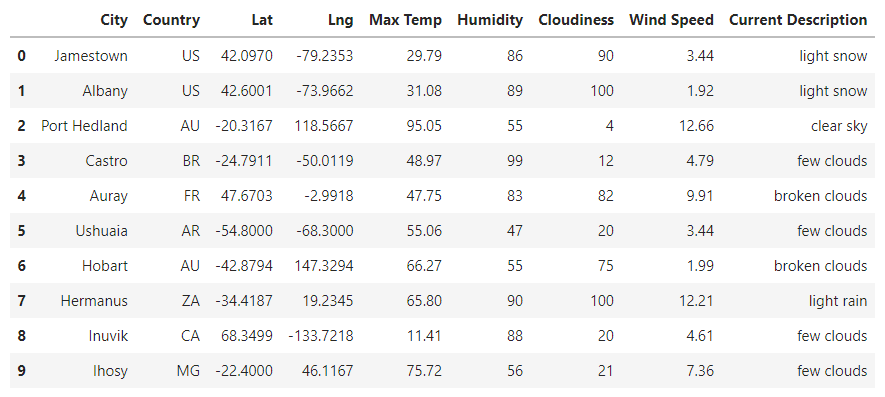
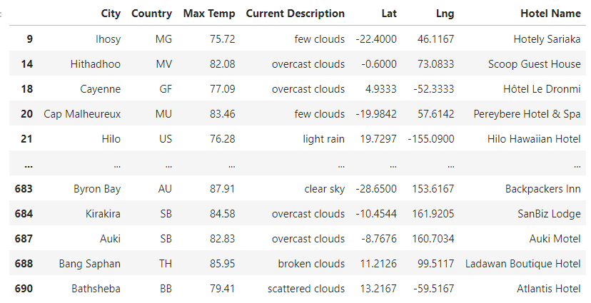
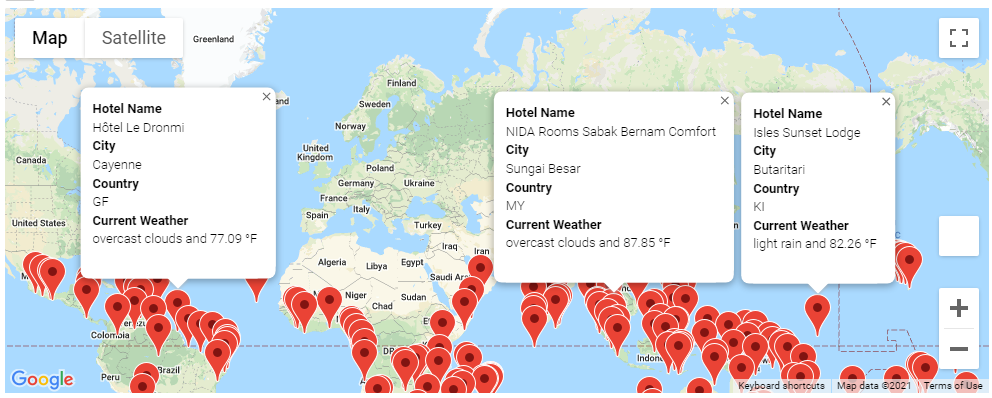
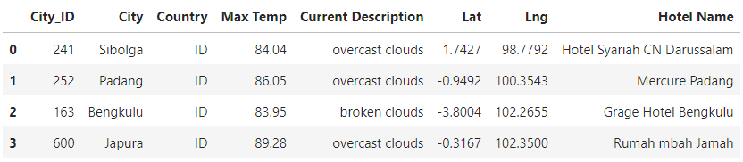
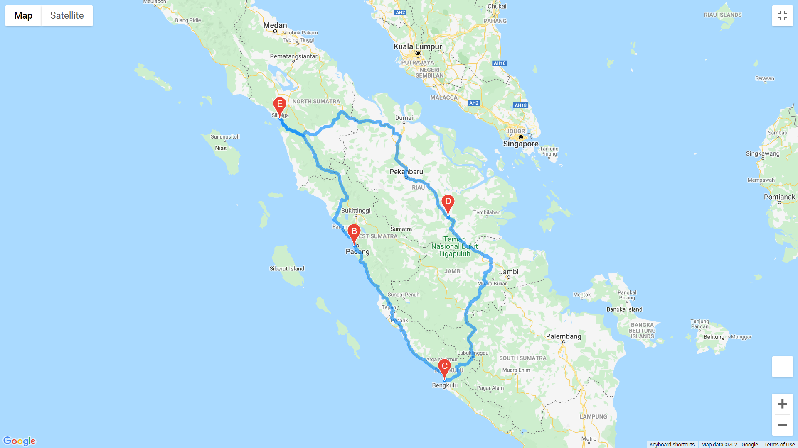
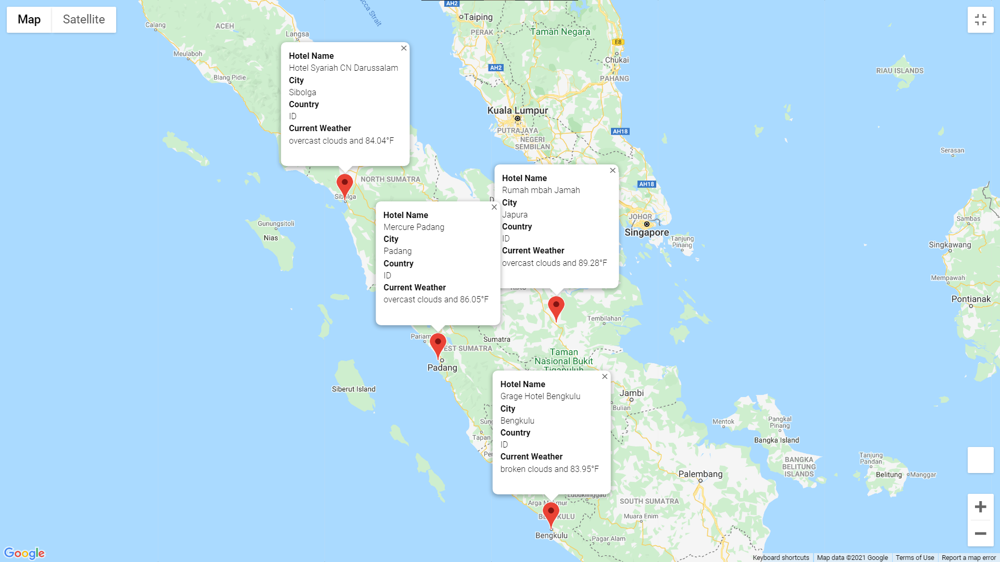

# World_Weather_Analysis

## Overview
Cities for 2000 randomly generated set coordinates was retrieved using the CitiPy module. OpenWeather API requests were made for each successfully identified city and the resulting JSON was parsed for various weather data and stored in [WeatherPy_Database.csv](weather_database/WeatherPy_Database.csv). Then, user input statements for minimum and maximum temperatures identified destinations within customer preferences with nearby hotels and current weather descriptions. These destinations, and their corresponding information, are then displayed as pop up markers on a map. Finally, a travel itinerary was generated from this filtered list of destinations and a travel route between four cities was displayed with popup markers for each city on the itinerary.

## Resources

Software:
* Python 3.7.10
* [citipy](https://github.com/wingchen/citipy) 
* OpenWeather API
* Google Maps Platform API (Places, Maps Javascript, Directions)
* Jupyter Notebook
* Anaconda

# Results

   
Summary DataFrame with Weather Details

    

    
Summary DataFrame for Weather and Hotel Details

     

    
Marker Layer for Destination

     

    
Summary DataFrame for Itinerary

     

    
Directions Layer for Itinerary

     

    
Marker Layer for Itinerary

     

